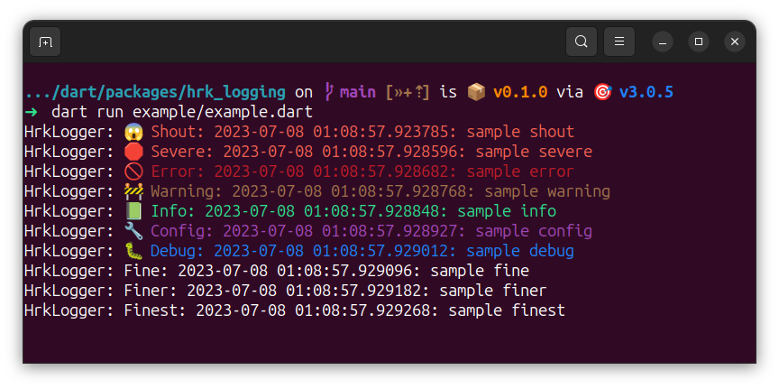

[![ci][ci-badge]][ci-link]
[![pub package link][pub-badge]][pub-link]
[![codecov link][codecov-badge]][codecov-link]

A library for beginners to quickly add colors and emojis to logs.

## Features

- Colorful Logs
- Relevant Emojis
- Support for `log.debug()` and `log.error()`
- Hierarchical logging is enabled
- Root Logger is set to `Level.ALL` in Debug Mode, else set to `Level.INFO`
- Root Logger is set to `Level.OFF` in Dart and Flutter Test

## Screenshots




## Getting started

```console
dart pub add hrk_logging
```

## Usage

```dart
import 'package:hrk_logging/hrk_logging.dart';

void main() {
  configureHrkLogging();
  final log = Logger('HrkLogger')..level = Level.ALL;
  log.shout('sample shout');
  log.severe('sample severe');
  log.error('sample error');
  log.warning('sample warning');
  log.info('sample info');
  log.config('sample config');
  log.debug('sample debug');
  log.fine('sample fine');
  log.finer('sample finer');
  log.finest('sample finest');
}
```

## Logging Levels in other Languages and Frameworks

- [RFC 5424 (syslog standard)]
- [java.util.logging.Level]
- [android.util.Log]
- [Log4J][Log4J Logging Levels]
- [Python][Python Logging Levels]
- [Swift]
- [glog]

## Credits

- If you find this package useful, make sure you do the following
  - Like the original [`logging`][logging-pub-link] package on pub.dev
  - Like [this][pub-link] package on pub.dev
  - Star [this][repo-link] repo on GitHub


[ci-badge]: https://github.com/hrishikesh-kadam/hrk_logging.dart/actions/workflows/ci.yaml/badge.svg
[ci-link]: https://github.com/hrishikesh-kadam/hrk_logging.dart/actions/workflows/ci.yaml
[pub-badge]: https://img.shields.io/pub/v/hrk_logging.svg
[pub-link]: https://pub.dev/packages/hrk_logging
[codecov-badge]: https://codecov.io/gh/hrishikesh-kadam/hrk_logging.dart/branch/main/graph/badge.svg
[codecov-link]: https://codecov.io/gh/hrishikesh-kadam/hrk_logging.dart
[RFC 5424 (syslog standard)]: https://datatracker.ietf.org/doc/html/rfc5424#section-6.2.1
[java.util.logging.Level]: https://docs.oracle.com/en/java/javase/20/docs/api/java.logging/java/util/logging/Level.html
[android.util.Log]: https://source.android.com/docs/core/tests/debug/understanding-logging
[Log4J Logging Levels]: https://logging.apache.org/log4j/2.x/manual/customloglevels.html
[Python Logging Levels]: https://docs.python.org/3/library/logging.html#logging-levels
[Swift]: https://www.swift.org/server/guides/libraries/log-levels.html
[glog]: https://github.com/google/glog#severity-levels
[logging-pub-link]: https://pub.dev/packages/logging
[repo-link]: https://github.com/hrishikesh-kadam/hrk_logging.dart
